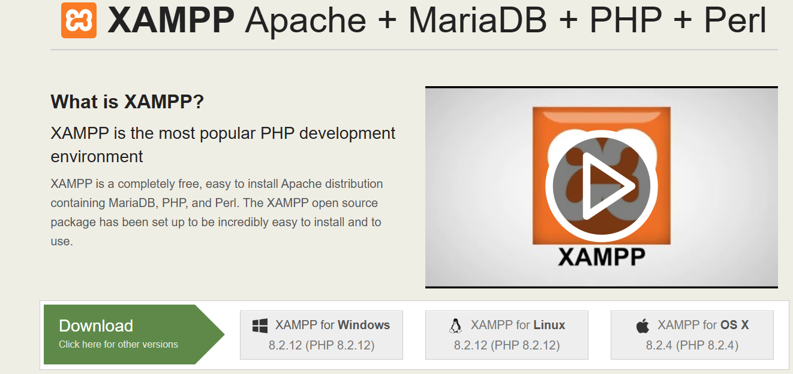

## Installing XAMPP

# Step 1: Download XAMPP
Go to the official XAMPP site: apachefriends.org.
Download the appropriate version for your operating system:
Windows: .exe file
MacOS: .dmg file
Linux: .run file

# Step 2: Installing on Windows
Run the installer:
- Double-click the downloaded file (xampp-win32-x.x.x-installer.exe).
- If a user control prompt appears, click "Yes".
- Then, choose the components you want to install (by default Apache, MySQL, PHP and Perl are selected). You can leave the default options.
- Select the installation folder. By default, it installs in C:\xampp. If you prefer another location, change it.
- Install by clicking "Next" and wait for the installation to finish.
- Finish, check the box to open the XAMPP Control Panel and click "Finish".

# Step 3: Start services:

- Open the XAMPP Control Panel.
- Start Apache and MySQL by clicking "Start".
