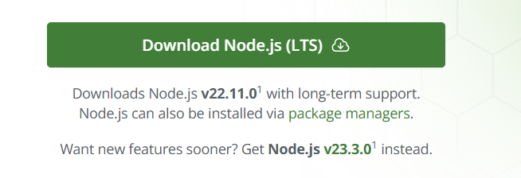
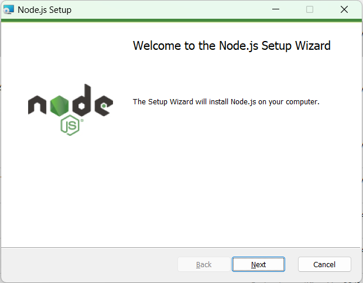
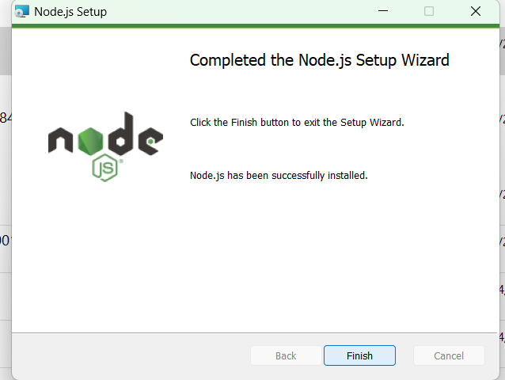
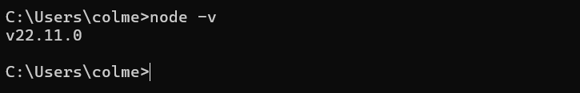
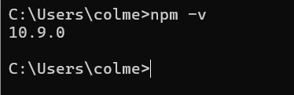

# Detailed guide to installing Node.js step by step

## Step 1: Download Node.js
1. Go to the official Node.js website: Open your browser and visit "https://nodejs.org/".
2. Click on the green "Download" button. It usually automatically downloads the "LTS (Long-Term Support)" version as it has stability and long-term support.

   

## Step 2: Installing on Windows
1. Run the installer: After downloading the .msi file, double-click it to begin the installation.

   

2. Follow the installation wizard:
On the first screen, accept the license terms and click "Next".
Choose the folder where you want to install Node.js or leave the default one.
Leave the default options enabled (in particular, the option to add Node.js to the PATH for easy use in the terminal).
Click "Install" to begin the installation.
3. Complete the installation: Once the installation is complete, click "Finish".

   

## Step 3: Verify the installation
1. Open the terminal or command line using "cmd" or "PowerShell".
2. Check the Node.js version, run the following command "node -v" to verify that Node.js was installed correctly. it should return the installed Node.js version.

   

3. Check the npm version, run the following command "npm -v" to check which version will be runnin

   

