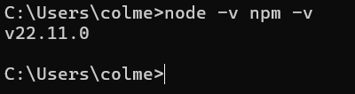
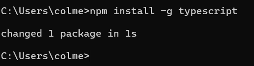
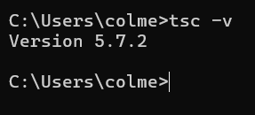

# Installing typescript
## Step 1: Check that you have Node.js and npm installed
TypeScript is installed through npm (Node Package Manager), which comes with Node.js. It is essential to make sure that our machine has Node.js
- To check if we have this app we must open our terminal or console. Type the following commands "node -v" "npm -v" to check if you have Node.js and npm installed.
If we look at the version, this means that Node.js and npm are already installed. On the other hand, if we see an empty line it means that our machine does not have the mentioned apps installed.

  

## Step 2: Install TypeScript globally
- In the terminal, we will run the command "npm install -g typescript" to install TypeScript globally. "-g" is responsible for installing globally.

  
  
- Verify that the installation was successful by checking the TypeScript version with the following command "tsc -v". You should see the latest version.

  
  
## Step 3: Try TypeScript
To use TypeScript you need to follow certain steps to place it in your project:
- Create a new folder for your project (if you don't have one)
- Initialize a package.json file, which is vital for creating project dependencies. To do this, use the command "npm init -y" to create a package.json file with the basic configuration.
- Install TypeScript locally in the project. It is important to install it as a dependency of the project. By running the command "npm install typescript --save-dev".
- Create the configuration file tsconfig.json, with the command "npx tsc --init" which will generate a tsconfig.json file with default settings for TypeScript (You can edit it)
